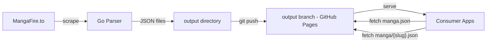
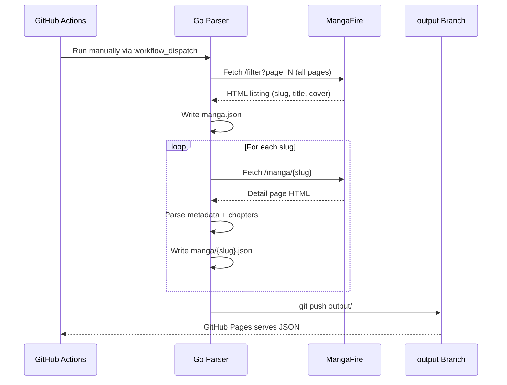

# MF-API

A Go scraper that extracts manga metadata from [MangaFire](https://mangafire.to)
and publishes structured JSON files as a static API via GitHub Pages.

> [!IMPORTANT]
> **Educational purpose only** — this project is provided under the MIT license.
> It is not intended to help circumvent paywalls, license restrictions, or
> facilitate piracy. This repository is meant for learning and experimentation —
> not for large-scale scraping. Please respect site terms and avoid abusive
> scraping.

---

## What it is

MF-API is a **data pipeline** that turns a live manga catalog into queryable
JSON files without running a server. The pipeline runs automatically every day
via GitHub Actions, and the output is served from a static branch — zero
infrastructure cost, zero maintenance.

### What it produces

| File | Description |
|---|---|
| `index.json` | Dataset metadata (timestamp, count) |
| `manga.json` | Full listing: `[{slug, title, cover, url}]` |
| `manga/{slug}.json` | Per-manga detail including chapters |

The files are published to the [`output`](https://github.com/Junior1Gamer/MF-API/tree/output)
branch and served at:

```
https://junior1gamer.github.io/MF-API/manga.json
https://junior1gamer.github.io/MF-API/manga/{slug}.json
```

---

## How it works



### Pipeline stages



### Key design decisions

| Decision | Rationale |
|---|---|
| **Parallel detail fetch** | 4 concurrent workers at 3 req/s — fits under rate limits while keeping a full scrape (~53K manga) within the 6 h GitHub Actions timeout |
| **Resume support** | Each detail file is written independently. If a run times out, the next run skips already-fetched slugs |
| **VRF token generation** | The site requires a challenge token for search. We ported the RC4 + transform algorithm from Kotatsu — no headless browser needed |
| **No server required** | JSON files are served directly from a GitHub Pages branch. No DB, no API gateway, no running costs |
| **GraphQL-like data model** | Consumers fetch the lightweight listing first, then only the detail files they need — keeping bandwidth low |

---

## Benefits

### For frontend developers

- **No backend to maintain** — consume the JSON directly from GitHub Pages
- **CORS-friendly** — GitHub Pages serves with permissive CORS headers
- **Static = fast** — files are CDN-cached by GitHub's Fastly edge
- **Predictable schema** — every manga has a stable slug-based URL

### Example use cases

```javascript
// 1. Get the full listing
const list = await fetch('https://junior1gamer.github.io/MF-API/manga.json');
const allManga = await list.json();

// 2. Show titles in a searchable grid
allManga.forEach(m => {
  renderCard(m.title, m.cover, m.slug);
});

// 3. On click, fetch detail
const detail = await fetch(
  `https://junior1gamer.github.io/MF-API/manga/${slug}.json`
);
const manga = await detail.json();
showDetail(manga.title, manga.description, manga.chapters);
```

---

## Project structure

```
MF-API/
    ├── .github/workflows/parser.yml   # Manual-trigger pipeline
├── cmd/mfapi/main.go               # CLI entry point
├── pkg/
│   ├── mfire/
│   │   ├── client.go              # HTTP client with retry & rate limiting
│   │   ├── detail.go              # Manga detail scraper + parallel worker pool
│   │   ├── list.go                # All-manga listing via pagination
│   │   ├── models.go              # Data types (MangaListItem, MangaDetail, Chapter)
│   │   ├── ratelimit.go           # Concurrent-safe token-bucket rate limiter
│   │   └── vrf.go                 # RC4-based VRF token generator
│   └── output/
│       └── writer.go              # JSON file output helpers
├── go.mod
├── go.sum
└── README.md
```

---

## Running locally

```bash
# Prerequisites: Go 1.21+
go mod tidy

# Fetch the full manga listing
go run ./cmd/mfapi/ --mode list --output output

# Fetch metadata for every manga (resume-safe, parallel)
go run ./cmd/mfapi/ --mode detail --output output --parallel 4 --rate-per-sec 3

# Or run both phases in one go
go run ./cmd/mfapi/ --mode full --output output --parallel 4 --rate-per-sec 3
```

### CLI flags

| Flag | Default | Description |
|---|---|---|
| `--mode` | `full` | `list`, `detail`, `full`, `search` |
| `--output` | `output` | Output directory |
| `--query` | — | Search keyword (`--mode=search`) |
| `--rate` | `500ms` | Min delay between serial requests |
| `--retries` | `3` | Max retries on failure |
| `--parallel` | `4` | Detail workers (0 = serial) |
| `--rate-per-sec` | `3` | Global req/s for parallel workers |

---

## Technical notes

- **Rate limiting**: The parallel phase uses a shared token bucket limited to
  3 req/s across all workers — well below typical bot-detection thresholds.
- **403 handling**: Cloudflare challenges trigger a 15–30 s backoff before
  retry (up to 3 times), then the slug is skipped.
- **Timeout resilience**: The detail phase writes files incrementally. A
  partial run deploys whatever was fetched. The next run's resume logic picks
  up where it left off.
- **VRF caching**: VRF tokens are LRU-cached (1024 entries) so repeated
  search queries don't recompute the expensive token generation.

---

## License

MIT — see the [`LICENSE`](LICENSE) file.

Powered by [Go](https://go.dev), scraped from [MangaFire](https://mangafire.to),
served by [GitHub Pages](https://pages.github.com).
