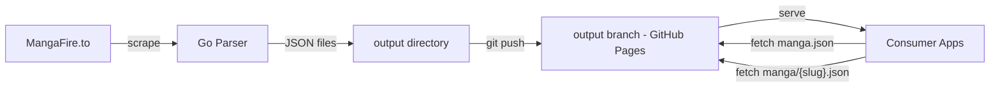
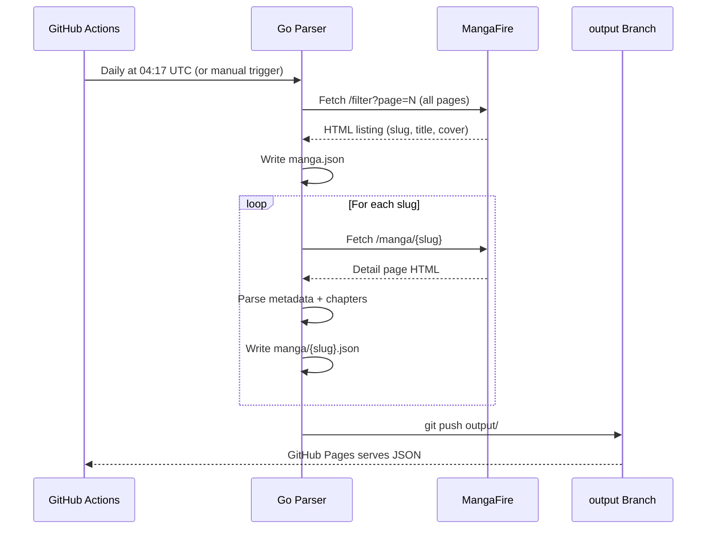

# MF-API

A Go scraper that extracts manga metadata from [MangaFire](https://mangafire.to)
and publishes structured JSON files as a static API via GitHub Pages.

> [!IMPORTANT]
> **Educational purpose only** — this project is provided under the MIT license.
> It is not intended to help circumvent paywalls, license restrictions, or
> facilitate piracy. This repository is meant for learning and experimentation —
> not for large-scale scraping. Please respect site terms and avoid abusive
> scraping.

---

## What it is

MF-API is a **data pipeline** that turns a live manga catalog into queryable
JSON files without running a server. The pipeline runs automatically once per
day via GitHub Actions (with manual trigger available), and the output is
served from a static branch — zero infrastructure cost, zero maintenance.

### What it produces

| File / Directory | Description |
|---|---|
| `index.json` | Dataset metadata (timestamp, count) |
| `manga.json` | Full listing: `[{slug, title, cover, url}]` |
| `manga/{slug}.json` | Per-manga detail including chapters |
| `manga/{slug}/chapters/{num}.json` | Page image URLs for a single chapter |

The files are published to the [`output`](https://github.com/Junior1Gamer/MF-API/tree/output)
branch and served at:

```
https://junior1gamer.github.io/MF-API/manga.json
https://junior1gamer.github.io/MF-API/manga/{slug}.json
https://junior1gamer.github.io/MF-API/manga/{slug}/chapters/{num}.json
```

---

## How it works



### Pipeline stages



### Key design decisions

| Decision | Rationale |
|---|---|
| **Parallel detail fetch** | 4 concurrent workers at 3 req/s — fits under rate limits while keeping a full scrape (~53K manga) within the 6 h GitHub Actions timeout |
| **Resume support** | Each detail file is written independently. If a run times out, the next run skips already-fetched slugs |
| **VRF token generation** | The site requires a challenge token for search. We ported the RC4 + transform algorithm from Kotatsu — no headless browser needed |
| **No server required** | JSON files are served directly from a GitHub Pages branch. No DB, no API gateway, no running costs |
| **GraphQL-like data model** | Consumers fetch the lightweight listing first, then only the detail files they need — keeping bandwidth low |
| **Chapter pages via AJAX** | Page image URLs are fetched from MangaFire's JSON API endpoint, not by scraping the reader page HTML |
| **Scrambled image awareness** | Some images have a `scrambled_offset` — the raw URL is stored with the offset so consumers can unscramble if needed |

---

## Benefits

### For frontend developers

- **No backend to maintain** — consume the JSON directly from GitHub Pages
- **CORS-friendly** — GitHub Pages serves with permissive CORS headers
- **Static = fast** — files are CDN-cached (GitHub Pages uses Fastly)
- **Predictable schema** — every manga has a stable slug-based URL

### Example use cases

```javascript
// 1. Get the full listing
const list = await fetch('https://junior1gamer.github.io/MF-API/manga.json');
const allManga = await list.json();

// 2. Show titles in a searchable grid
allManga.forEach(m => {
  renderCard(m.title, m.cover, m.slug);
});

// 3. On click, fetch detail
const detail = await fetch(
  `https://junior1gamer.github.io/MF-API/manga/${slug}.json`
);
const manga = await detail.json();
showDetail(manga.title, manga.description, manga.chapters);

// 4. When user opens a chapter, fetch the page images
const chapter = await fetch(
  `https://junior1gamer.github.io/MF-API/manga/${slug}/chapters/1.json`
);
chapter.pages.forEach(p => {
  // p.url — the image URL
  // p.scrambled_offset — >0 means the image is puzzle-scrambled
});
```

---

## Project structure

```
MF-API/
├── .github/
│   └── workflows/
│       └── parser.yml              # Daily schedule + manual trigger
├── cmd/
│   └── mfapi/
│       └── main.go                 # CLI entry point
├── pkg/
│   ├── mfire/
│   │   ├── chapters.go            # AJAX chapter list & page image fetcher
│   │   ├── client.go              # HTTP client with retry & rate limiting
│   │   ├── detail.go              # Manga detail scraper + parallel worker pool
│   │   ├── list.go                # All-manga listing via pagination
│   │   ├── models.go              # Data types
│   │   ├── ratelimit.go           # Concurrent-safe token-bucket rate limiter
│   │   └── vrf.go                 # RC4-based VRF token generator
│   └── output/
│       └── writer.go              # JSON file output helpers
├── go.mod
├── go.sum
└── README.md
```

---

## Running locally

```bash
# Prerequisites: Go 1.21+
go mod tidy

# Fetch the full manga listing
go run ./cmd/mfapi/ --mode list --output output

# Fetch metadata for every manga (resume-safe, parallel)
go run ./cmd/mfapi/ --mode detail --output output --parallel 4 --rate-per-sec 3

# Fetch chapter page images for a single manga
go run ./cmd/mfapi/ --mode chapters --slug one-piece.1 --parallel 4 --rate-per-sec 3

# Fetch chapter page images for ALL manga (reads manga.json internally)
go run ./cmd/mfapi/ --mode chapters --output output --parallel 4 --rate-per-sec 3

# Or run both listing + detail in one go
go run ./cmd/mfapi/ --mode full --output output --parallel 4 --rate-per-sec 3
```

> [!NOTE]
> **Chapter pages are not included in the automatic daily workflow.**
> The `--mode chapters` phase is separate because fetching page URLs for every
> chapter of every manga would require millions of API calls — far exceeding the
> 6-hour GitHub Actions job limit even with parallel workers. Use it as a
> **targeted manual run** for specific manga you need images for. The phase is
> still resume-safe: if a chapters run is interrupted, re-running skips already-
> fetched chapter files.
> 
> For comparison: the `detail` phase (which _is_ automated) only stores chapter
> _metadata_ (number, title, date). Adding page URLs would balloon each manga
> detail file from ~5 KB to potentially hundreds of KB. The split keeps the
> automated pipeline fast while still giving consumers access to page data when
> needed.

# Or run both listing + detail in one go
go run ./cmd/mfapi/ --mode full --output output --parallel 4 --rate-per-sec 3
```

### CLI flags

| Flag | Default | Description |
|---|---|---|
| `--mode` | `full` | `list`, `detail`, `full`, `search`, `chapters` |
| `--output` | `output` | Output directory |
| `--query` | — | Search keyword (`--mode=search`) |
| `--slug` | — | Single manga slug (`--mode=chapters`) |
| `--limit` | `0` | Max results (0 = all) |
| `--rate` | `500ms` | Min delay between serial requests |
| `--retries` | `3` | Max retries on failure |
| `--parallel` | `4` | Detail/chapter workers (0 = serial) |
| `--rate-per-sec` | `3` | Global req/s for parallel workers |
| `--chapter-type` | `chapter` | Branch type: `chapter` or `volume` |
| `--chapter-lang` | `en` | Chapter language code |

---

## Technical notes

- **Rate limiting**: The parallel phase uses a shared token bucket limited to
  3 req/s across all workers — well below typical bot-detection thresholds.
- **403 handling**: Cloudflare challenges trigger a 15–30 s backoff before
  retry (up to 3 times), then the slug is skipped.
- **Timeout resilience**: Both detail and chapter phases write files
  incrementally. A partial run deploys whatever was fetched. The next run's
  resume logic picks up where it left off.
- **VRF caching**: VRF tokens are LRU-cached (1024 entries) so repeated
  search queries don't recompute the expensive token generation.
- **Scrambled images**: Some chapter page images returned by MangaFire's API
  include a scrambling offset (`scrambled_offset > 0`). The image pixels are
  rearranged in a 200×200 px grid pattern. Consumers can reverse the
  transform using the Kotatsu reference algorithm:

  ```
  xSrc = (xMax - x + offset) % xMax
  ySrc = (yMax - y + offset) % yMax
  ```

  where `x, y` is the destination piece position and `xMax, yMax` are the
  number of pieces along each axis.

---

## License

MIT — see the [`LICENSE`](LICENSE) file.

Powered by [Go](https://go.dev), scraped from [MangaFire](https://mangafire.to),
served by [GitHub Pages](https://pages.github.com).
